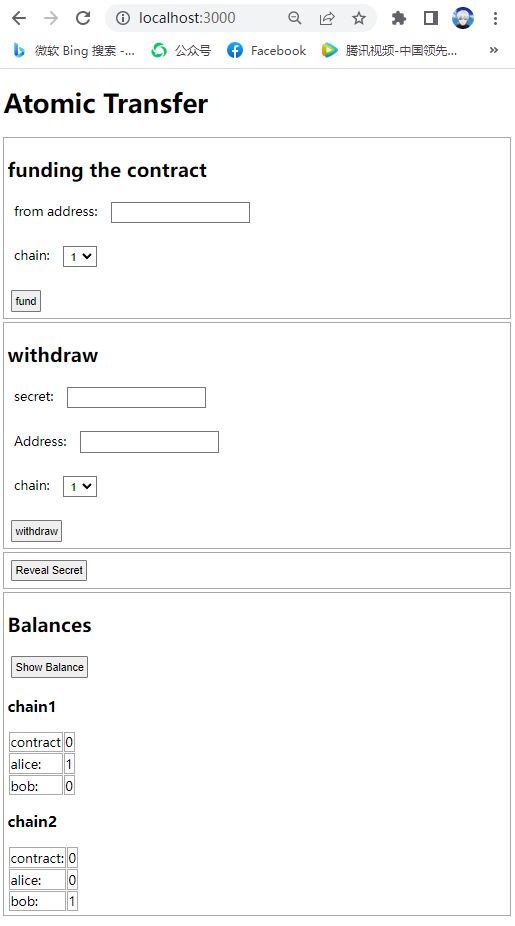

# An atomic swap smart contract using hashed time lock

## Introduction
To build the ERC20 atomic swap application I created a smart contract.
As a bases a smart  contract from [github](https://github.com/jklepatch/eattheblocks/blob/master/screencast/251-atomic-swap-ethereum-bsc/contracts/HTLC.sol) was used.
The code was extended to store a `timeHash` instead of a time stamp within the contract.
To calculate the hash, I use the modulo (%) operation on the timestamp, it is possible to verify the a time range without directly storing a time value.
An other change is that the hash is inserted via argument when deploying the contract. So we have a smart contract source code, that can be reused for many transactions.

I used the [./deployContract.js] script to verify some functionality that can run without the truffle test cli. This is needed so I can be sure that it is possible to execute the methods within a express/node.js application. With that script I first created a token. Then deploy the smart Contract and executed the fund and withdraw function.

In this demo project, the token and the smart contract is deployed via truffle migration. When continuing the project, the node.js application should also do that.

## Installation
1. install [node.js](https://nodejs.org/en/)
2. install Truffle globally
```
npm install -g truffle
```
3. install the dependencies
```
git clone {url}
cd ./{pathToDir}
npm install
```
4. configure the network setting in  `truffle-config` and `./migrations/2_deploy_contracts.js`, start the test blockchain server such as [ganache](https://trufflesuite.com/ganache/) if needed
5. input Alice and Bob public address and the secret in `config.js`
6. run the migration code to deploy the coin contract in `each` network to fulfill step 1&2 in the procedures
``` 
truffle migrate --network {networkName}
```
for my test that is
```
truffle migrate --network development1
truffle migrate --network development2
```
7. run test to see if the contract build and deployment is successful
``` 
truffle test --network {networkName}
```
again, for the test in my environment
```
truffle test --network development1
```
8. start the web app
``` 
npm run start
```
9. open `localhost:3000` in browser and follow step3 to finish the swap



## Procedures
### Prerequisite
1. deploy a tokenA smart contract on chain1 for Bob, given him one tokenA for swap
2. deploy a tokenB smart contract on chain2 for Alice, given her one tokenB for swap
### Smart contract deployment
3. Bob makes up a secret and hash it into a secret token and give Alice that token
4. Bob deploys an atomic swap smart contract on chain1 using the secret token
5. Alice deploys the same smart contract on chain2 using the same token
### Swap
6. Bob sends the tokenA to the contract
7. Alice sends the tokenB to the contract
8. Bob withdraws tokenB from the contract in chain2 by providing the secret
10. When smart contract releases the money to Bob, it make the secret public for Alice to know
11. Alice will be able to withdraw tokenA as she knows the secret now
12. Alice can always get the refund from the smart contract after a certain amount of time if Bob didn't withdraw and release the secret

>note: in step 4&5, Alice will always deploy the smart contract with much longer time frame than Bob, it will make Alice have enough time to withdraw money from the contract, even if Bob withdraws in the last minute in his time frame

## Todos
* Deploy the contract via API.
* Use database to maintain state. so that alice and bob can have accounts. and can work on a number of concurrent transactions with different users at the same time
* Authenticate alice and bob via metamask
* Alice and Bob might not want to use the same provider of this app. This app might need to be open sourced. so that alice and bob can either find a hosting provider or host themselves. When having such a setup, it can be useful, to enable multiple installations of this application to communicate with each other via public APIs and webhooks. 
* Run this on a public chain such as Ropsten or Kovan
> note: current version code was tested and proven functional in a local environment only
* To support other blockchains, it is needed to maintain there websocket URLs.
* We can provide API access for other companies, so that they can offer atomic multi chain token swap to their users.    
* More test cases for the smart contract
* Use a framework on frontend and beautify the UI
* Write test cases for the web server
